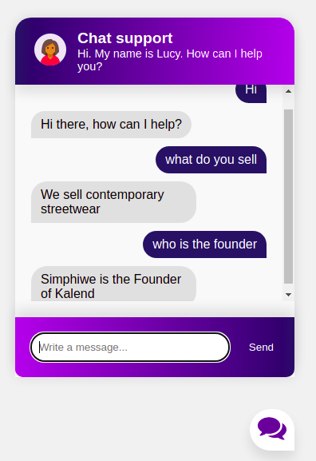

# Chatbot in PyTorch.  
Simple online store chatbot implementation with PyTorch. 
Used a supervised NLP Deep learing algorithms, which also includes (Steming, tokenization, bag of words)

## Initial Setup:
This repo currently contains the starter files.

Clone repo and create a virtual environment
```
$ git clone https://github.com/ssfakude/DeepLearning-Chatbot.git
$ cd  DeepLearning-Chatbot
$ python3 -m venv venv
$ . venv/bin/activate
```
Install dependencies
```
$ (venv) pip install Flask torch torchvision nltk
```
Install nltk package
```
$ (venv) python
>>> import nltk
>>> nltk.download('punkt')
```
## Usage
Run
```
$ (venv) python train.py
```
This will dump data.pth file. And then run
the following command to test it in the console.
```
$ (venv) python chat.py
```
## Customize
Have a look at [intents.json](intents.json). You can customize it according to your own use case. Just define a new `tag`, possible `patterns`, and possible `responses` for the chat bot. You have to re-run the training whenever this file is modified.
```console
{
  "intents": [
    {
      "tag": "greeting",
      "patterns": [
        "Hi",
        "Hey",
        "Howzit",
        "How are you",
        "Is anyone there?",
        "Hello",
        "Good day"
      ],
      "responses": [
        "Hey :-)",
        "Hello, thanks for visiting",
        "Hi there, what can I do for you?",
        "Hi there, how can I help?"
      ]
    },
    ...
  ]
}
```

## Credits
The approach is inspired by this article and ported to PyTorch: [https://chatbotsmagazine.com/contextual-chat-bots-with-tensorflow-4391749d0077](https://chatbotsmagazine.com/contextual-chat-bots-with-tensorflow-4391749d0077).
